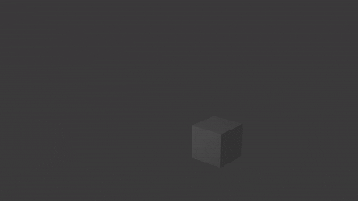

# Práctica 3
## Cinématica directa
[Modelo](https://sketchfab.com/3d-models/rigged-high-poly-legs-2f0f2ba4e4504d44ae85c99bb6e60fc8)

El modelo utilizado ya tenía huesos para poder animar con cinématica por lo que se eliminaron para poder rehacerlo
Para animar la cinemática directa se utilizó blender creando un elemento 'Armature' sobre un modelo ya creado, en este se agregaban los huesos según la forma del modelo, y directamente en blender se podía emparentar el modelo a la forma definida para simplificar la unión entre el modelo y los huesos.
Para la animación en blender se usaron 'keyframes' para dar las poses de las piernas y tambíén crear las transiciones entre cada keyframe para generar una animación completa.

## Cinématica inversa
[Modelo](https://sketchfab.com/3d-models/gilberto-a-robot-arm-362d32e0b32945ae8174ebf71dae97f0)

El modelo utilizado ya tenía huesos para poder animar con cinématica por lo que se eliminaron para poder rehacerlo
Para crear la cinemática inversa fue similar a la anterior, con la excepción que uno de los huesos que se crearon se le dió la propiedad de cinemática inversa, con esto el hueso tenía una libertad completa de movimiento y todos los huesos cercanos actuaban según él.

## Animación
La animación del cubo por defecto de blender tiene en cuenta el principio de la anticipación y el estirar y encoger objetos para dar la sensación de velocidad, también se uso la aceleración para tener movimientos más fluídos 
Para animat este modelo se usó inicialmente solo keyframes directamente transformando el cubo, pero para la segunda parte se usaron 'Armatures' para poder tener la capacidad de deformar el cubo con mayor libertad

